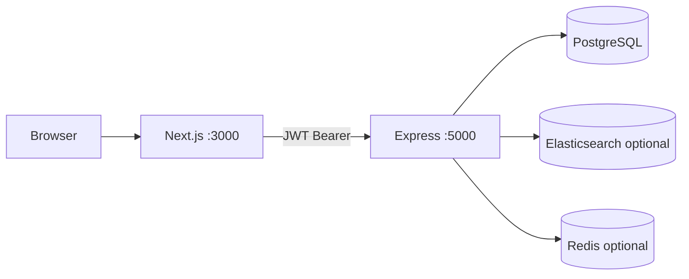

# 1. Project setup (in-depth)

This guide explains how HelpOrbit is bootstrapped: backend API, frontend app, database, and shared patterns used by every module.

---

## 1.1 Architecture



| Layer | Path | Tech |
|-------|------|------|
| Frontend | `frontend/` | Next.js 16, React 19, Tailwind v4 |
| Backend | `backend/` | Express 5, Joi, `pg` |
| Config | `backend/.env` | Secrets (gitignored) |

---

## 1.2 Prerequisites & install

```bash
# Node 18+ required
node -v

git clone <repo-url> && cd HelpOrbit

cd backend && npm install
cd ../frontend && npm install
```

---

## 1.3 Environment variables

Copy `backend/.env.example` → `backend/.env`:

```env
PORT=5000
NODE_ENV=development
CORS_ORIGIN=http://localhost:3000

DB_USER=postgres
DB_HOST=localhost
DB_NAME=helporbit_db
DB_PASSWORD=your-password
DB_PORT=5432

JWT_SECRET=use-a-long-random-string
JWT_EXPIRES_IN=7d
BCRYPT_ROUNDS=10

ELASTIC_ENABLED=false
REDIS_ENABLED=false
```

Frontend (`frontend/.env.local`):

```env
NEXT_PUBLIC_API_URL=http://localhost:5000/api
```

**How env is loaded on the backend** — `backend/src/config/env.js`:

```javascript
require("dotenv").config();

module.exports = {
  port: Number(process.env.PORT) || 5000,
  jwt: {
    secret: process.env.JWT_SECRET || "change-me-in-production",
    expiresIn: process.env.JWT_EXPIRES_IN || "7d",
  },
  corsOrigin: process.env.CORS_ORIGIN || "*",
  elastic: {
    enabled: boolEnv("ELASTIC_ENABLED", false),
    auditLogsIndex: process.env.ELASTIC_AUDIT_LOGS_INDEX || "helporbit-audit-logs",
  },
};
```

---

## 1.4 Database setup

```bash
createdb helporbit_db
cd backend
psql -d helporbit_db -f migrations/004_activity_logs.sql
psql -d helporbit_db -f migrations/005_policy_name.sql
psql -d helporbit_db -f migrations/006_company_address_fields.sql
psql -d helporbit_db -f migrations/007_company_addresses_table.sql
psql -d helporbit_db -f migrations/008_rename_address_line_1.sql
```

Base tables (`users`, `roles`, `companies`, etc.) must exist before migrations — see [db-schema.md](../db-schema.md).

Create an **admin** user with bcrypt-hashed password and `role_id` pointing to admin role.

---

## 1.5 Backend entry points

### `server.js` — starts HTTP server

```javascript
const app = require("./app");
const env = require("./config/env");

const server = app.listen(env.port, () => {
  logger.info(`HelpOrbit API listening on port ${env.port}`);
});
```

Graceful shutdown closes the Postgres pool on `SIGINT` / `SIGTERM`.

### `app.js` — Express middleware & routes

```javascript
app.use(cors({ origin: env.corsOrigin, credentials: true }));
app.use(express.json({ limit: "1mb" }));
app.use(requestLogger);

app.get("/health", async (req, res) => {
  await pool.query("SELECT 1");
  // ... elasticsearch ping ...
  res.json(health);
});

app.use("/api/auth", require("./routes/auth.routes"));
app.use("/api/companies", require("./routes/company.routes"));
app.use("/api/users", require("./routes/user.routes"));
app.use("/api/policies", require("./routes/policy.routes"));
app.use("/api/activity-logs", require("./routes/activity.routes"));

app.use(notFoundHandler);
app.use(errorHandler);
```

**Run:**

```bash
cd backend && npm run dev
curl http://localhost:5000/health
```

---

## 1.6 Request validation (Joi)

All modules use the same middleware — `backend/src/middleware/validate.js`:

```javascript
function validate(schema, property = "body") {
  return (req, _res, next) => {
    const { value, error } = schema.validate(req[property], {
      abortEarly: false,
      stripUnknown: true,
      convert: true,
    });
    if (error) {
      const details = error.details.map((d) => ({
        path: d.path.join("."),
        message: d.message,
      }));
      return next(ApiError.badRequest("Validation failed", details));
    }
    req[property] = value;
    next();
  };
}
```

**Usage in routes:**

```javascript
router.post("/", validate(createCompanySchema), companyController.create);
router.get("/", validate(listCompaniesQuerySchema, "query"), companyController.list);
```

---

## 1.7 Authentication (foundation)

### Login service

`backend/src/services/auth.service.js`:

```javascript
async function login({ identifier, password }) {
  const user = await userModel.findByEmailOrUsername(identifier);
  if (!user) throw ApiError.unauthorized("Invalid credentials");

  const ok = await verifyAndUpgrade(user, password);
  if (!ok) throw ApiError.unauthorized("Invalid credentials");

  const token = signToken({
    sub: user.id,
    email: user.email,
    roleId: user.role_id,
    roleName: user.role_name,
  });

  return { token, user: userModel.sanitize(user) };
}
```

### Protect routes

```javascript
const { authenticate } = require("../middleware/auth.middleware");
const { requireAdmin } = require("../middleware/role.middleware");

router.use(authenticate, requireAdmin);
```

`authenticate` reads `Authorization: Bearer <token>` and sets `req.user`.

---

## 1.8 Frontend foundation

### Root layout — providers

`frontend/src/app/layout.tsx` wraps the app with:

- `ThemeProvider`
- `AuthProvider`
- `ToastProvider`

### API client

`frontend/src/lib/api.ts` — every module calls this:

```typescript
const API_URL =
  process.env.NEXT_PUBLIC_API_URL?.replace(/\/$/, "") ||
  "http://localhost:5000/api";

export async function apiFetch<T>(path: string, { body, auth = true, ...rest }) {
  const finalHeaders = { Accept: "application/json" };
  if (auth) {
    const token = getToken();
    if (token) finalHeaders["Authorization"] = `Bearer ${token}`;
  }
  const res = await fetch(`${API_URL}${path}`, { ... });
  if (!res.ok) {
    if (res.status === 401) clearSession();
    throw new ApiError(res.status, message);
  }
  return json as T;
}

export const api = {
  get: <T>(path, opts?) => apiFetch<T>(path, { method: "GET", ...opts }),
  post: <T>(path, body?, opts?) => apiFetch<T>(path, { method: "POST", body, ...opts }),
  // put, del ...
};
```

### Session storage

`frontend/src/lib/auth.ts`:

```typescript
const TOKEN_KEY = "helporbit.token";
const USER_KEY = "helporbit.user";

export function setSession(token: string, user: AuthUser) {
  window.localStorage.setItem(TOKEN_KEY, token);
  window.localStorage.setItem(USER_KEY, JSON.stringify(user));
}
```

---

## 1.9 Standard API response shape

**Success:**

```json
{
  "success": true,
  "data": { ... }
}
```

**Error (from `ApiError`):**

```json
{
  "success": false,
  "message": "Validation failed",
  "details": [{ "path": "email", "message": "..." }]
}
```

---

## 1.10 Layered backend pattern (all modules)

```
routes/*.routes.js     → HTTP paths, middleware chain
controllers/*.js       → parse req, call service, res.json()
services/*.js          → business rules, transactions, audit calls
models/*.js            → SQL only
validators/*.js        → Joi schemas
```

**Example flow for any POST:**

1. `authenticate` + `requireAdmin`
2. `validate(schema)`
3. `controller.create` → `service.create` → `model.create`
4. Optional: `activityLog.recordCreated(...)`

---

## 1.11 Run full stack

```bash
# Terminal 1
cd backend && npm run dev

# Terminal 2
cd frontend && npm run dev
```

Open `http://localhost:3000` → redirects to login or dashboard.

---

## 1.12 Next

→ [02-login-page.md](./02-login-page.md)
