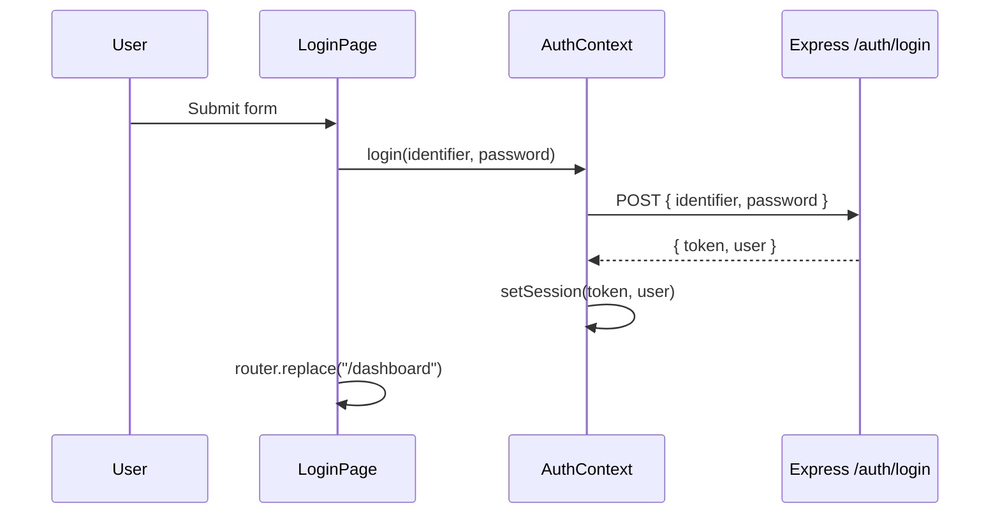

# 2. Login page (in-depth)

Route: **`/login`** · File: `frontend/src/app/login/page.tsx`

---

## 2.1 Purpose

- Collect **identifier** (email or username) + **password**
- Call `POST /api/auth/login`
- Store JWT + user in `localStorage`
- Redirect to `/dashboard`

---

## 2.2 Flow diagram



---

## 2.3 Backend: login endpoint

**Route** — `backend/src/routes/auth.routes.js`:

```javascript
router.post("/login", validate(loginSchema), login);
router.get("/me", authenticate, me);
```

**Validator** — `backend/src/validators/auth.validator.js`:

```javascript
const loginSchema = Joi.object({
  identifier: Joi.string().trim().min(3).max(150).required(),
  password: Joi.string().min(1).max(200).required(),
});
```

**Controller** — returns:

```json
{
  "success": true,
  "message": "Login successful",
  "data": {
    "token": "eyJhbG...",
    "user": {
      "id": 1,
      "email": "admin@example.com",
      "role_name": "admin",
      "first_name": "Radhe",
      ...
    }
  }
}
```

**Test with curl:**

```bash
curl -X POST http://localhost:5000/api/auth/login \
  -H "Content-Type: application/json" \
  -d '{"identifier":"admin@example.com","password":"your-password"}'
```

---

## 2.4 Frontend: AuthContext

`frontend/src/contexts/AuthContext.tsx`

**Hydration on load:**

```typescript
useEffect(() => {
  setUser(getUser());
  setToken(getToken());
  setLoading(false);
}, []);
```

**Login function:**

```typescript
const login = useCallback(async (identifier: string, password: string) => {
  const res = await api.post<LoginResponse>(
    "/auth/login",
    { identifier, password },
    { auth: false }  // no Bearer header on login
  );
  const { token: newToken, user: newUser } = res.data;
  setSession(newToken, newUser);
  setToken(newToken);
  setUser(newUser);
  return newUser;
}, []);
```

Note `{ auth: false }` — login must not send an old token.

---

## 2.5 Login page component

`frontend/src/app/login/page.tsx` (key parts):

**Redirect if already logged in:**

```typescript
useEffect(() => {
  if (!hydrating && token) router.replace("/dashboard");
}, [hydrating, token, router]);
```

**Submit handler:**

```typescript
async function handleSubmit(e: FormEvent) {
  e.preventDefault();
  setSubmitting(true);
  try {
    await login(identifier.trim(), password);
    toast("Signed in successfully. Welcome back!", "success");
    router.replace("/dashboard");
  } catch (err) {
    const message =
      err instanceof ApiError ? err.message : "Sign in failed...";
    setError(message);
    toast(message, "error");
  } finally {
    setSubmitting(false);
  }
}
```

**While hydrating** — show `BrandedLoader` so users don't flash the form when already logged in.

**UI elements:**

- `Logo` component
- Identifier + password inputs
- Show/hide password toggle
- Submit button disabled when `submitting`

---

## 2.6 Route protection (dashboard)

`frontend/src/app/dashboard/layout.tsx`:

```typescript
useEffect(() => {
  if (!loading && !token) router.replace("/login");
}, [loading, token, router]);
```

Only renders `MainLayout` when `token` exists.

**Root redirect** — `frontend/src/app/page.tsx` sends `/` → `/dashboard` or `/login` based on token.

---

## 2.7 Error handling

| Case | Behavior |
|------|----------|
| Wrong password | 401, message "Invalid credentials", toast + inline error |
| Missing fields | HTML5 `required` on inputs |
| Expired token on other pages | `apiFetch` clears session on 401 |

---

## 2.8 Files checklist

| File | Role |
|------|------|
| `app/login/page.tsx` | Login UI |
| `contexts/AuthContext.tsx` | login/logout state |
| `lib/auth.ts` | localStorage keys |
| `lib/api.ts` | HTTP + Bearer |
| `backend/.../auth.service.js` | Verify password, sign JWT |
| `backend/.../auth.middleware.js` | `authenticate` for protected APIs |

---

## 2.9 Next

→ [03-dashboard.md](./03-dashboard.md)
