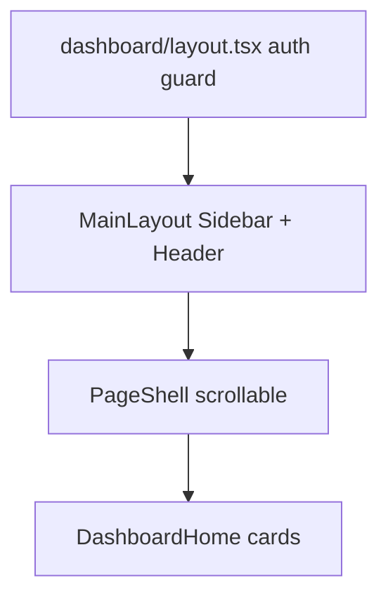

# 3. Dashboard home (in-depth)

Route: **`/dashboard`** · Page: `frontend/src/app/dashboard/page.tsx` · UI: `DashboardHome.tsx`

---

## 3.1 Purpose

After login, admins land on a **marketing-style home** that:

- Greets the user by first name
- Explains HelpOrbit (about, how it works, capabilities)
- Shows tech stack and request flow
- Links to live modules (Companies, Users, Policies, Activity logs)

This is **not** a metrics/analytics dashboard (that nav item is "Soon").

---

## 3.2 Layout hierarchy



**Page** sets header via context:

```typescript
const pageHeader = useMemo(
  () => ({
    title: "Dashboard",
    description: `Welcome back, ${firstName}`,
    breadcrumbs: [{ label: "Dashboard" }],
  }),
  [user, firstName]
);
usePageHeader(pageHeader);
```

**Admin-only modules** — pass `isAdmin` to filter cards:

```typescript
const isAdmin = user?.role_name?.toLowerCase() === "admin";
return <DashboardHome isAdmin={isAdmin} />;
```

---

## 3.3 Content configuration

All copy lives in **`frontend/src/config/dashboardContent.ts`** so juniors can edit text without touching layout code.

**About block:**

```typescript
export const APP_ABOUT = {
  name: "HelpOrbit",
  tagline: "Multi-company customer support management platform",
  goal: "HelpOrbit helps organizations deliver consistent...",
  howItWorks: [
    "Administrators create and manage companies.",
    "Support users are added into the platform.",
    // ...
  ],
  keyCapabilities: [
    "Multi-company support management",
    "Audit logs and activity tracking",
    // ...
  ],
};
```

**Module cards:**

```typescript
export const DASHBOARD_MODULES: DashboardModule[] = [
  {
    id: "companies",
    title: "Company Management",
    href: "/dashboard/companies",
    status: "live",
    adminOnly: true,
    icon: Building2,
  },
  {
    id: "analytics",
    title: "Analytics",
    status: "soon",  // no href — disabled card
    adminOnly: true,
  },
  // ...
];
```

---

## 3.4 DashboardHome component

`frontend/src/components/dashboard/DashboardHome.tsx`:

```typescript
export function DashboardHome({ isAdmin }: { isAdmin: boolean }) {
  const visibleModules = DASHBOARD_MODULES.filter(
    (m) => !m.adminOnly || isAdmin
  );

  return (
    <div className="dashboard-home">
      {/* About card */}
      {/* 2-column: how it works + capabilities */}
      {/* Tech stack: TECH_STACK.map → 4 cards */}
      {/* Request flow: ARCHITECTURE_FLOW tags */}
      {/* Modules grid: visibleModules.map → ModuleCard */}
    </div>
  );
}
```

**Live module link:**

```typescript
if (isLive) {
  return (
    <Link href={mod.href!} className="dashboard-card-link">
      {inner}
    </Link>
  );
}
```

**Soon module** — disabled wrapper, muted "Soon" tag.

---

## 3.5 Styling

CSS classes in `frontend/src/app/globals.css`:

| Class | Purpose |
|-------|---------|
| `.dashboard-home` | Vertical flex, gap between sections |
| `.dashboard-card` | White card, border, shadow |
| `.dashboard-card-row--2` | 2 columns on large screens |
| `.dashboard-card-row--4` | Tech stack 4 columns |
| `.dashboard-tag` | Blue pill for stack items |

Uses same `app-main` padding as Companies/Users (not full-bleed).

---

## 3.6 Sidebar navigation

`frontend/src/config/navigation.ts`:

```typescript
export const mainNav: NavItem[] = [
  { label: "Dashboard", href: "/dashboard", icon: LayoutDashboard },
  { label: "Companies", href: "/dashboard/companies", adminOnly: true },
  { label: "Activity logs", href: "/dashboard/activity", adminOnly: true },
  { label: "Users", href: "/dashboard/users", adminOnly: true },
  { label: "Policies", href: "/dashboard/policies", adminOnly: true },
];
```

Active item uses `resolveActiveNavHref(pathname, items)` — longest matching path wins.

---

## 3.7 PageHeaderContext

Any dashboard child can set the sticky header:

```typescript
usePageHeader({
  title: "Company Management",
  description: "...",
  breadcrumbs: [
    { label: "Dashboard", href: "/dashboard" },
    { label: "Companies" },
  ],
  actions: <button>Add company</button>,
});
```

Rendered in `Header.tsx`.

---

## 3.8 Files checklist

| File | Role |
|------|------|
| `app/dashboard/page.tsx` | Route + header |
| `app/dashboard/layout.tsx` | Auth guard + MainLayout |
| `components/dashboard/DashboardHome.tsx` | Card UI |
| `config/dashboardContent.ts` | Copy + module list |
| `components/layout/MainLayout.tsx` | Shell |
| `contexts/PageHeaderContext.tsx` | Dynamic header |

---

## 3.9 Next

→ [04-company-module.md](./04-company-module.md)
