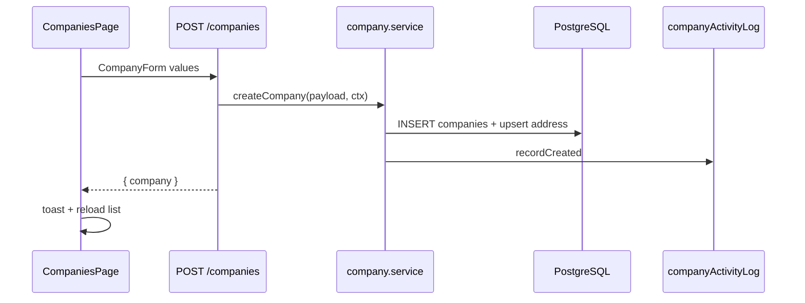

# 4. Company module (in-depth)

Route: **`/dashboard/companies`** · API: **`/api/companies`**

---

## 4.1 Data model

**`companies`**

| Column | Notes |
|--------|--------|
| `id` | UUID PK |
| `title`, `email`, `phone`, `description` | Core fields |
| `is_active`, `is_deleted` | Status + soft delete |

**`company_addresses`** (one per company)

| Column | Notes |
|--------|--------|
| `company_id` | UNIQUE FK |
| `address_line_1`, `city`, `state`, `country`, `pin_code` | |
| `formatted_address` | Denormalized display string |

---

## 4.2 API reference

All routes: `authenticate` + `requireAdmin`.

| Method | Path | Description |
|--------|------|-------------|
| GET | `/api/companies` | List (paginated) |
| GET | `/api/companies/:id` | Detail + address |
| POST | `/api/companies` | Create |
| PUT | `/api/companies/:id` | Update |
| DELETE | `/api/companies/:id` | Soft delete |
| GET | `/api/companies/activity-logs` | Company audit list |

**List query:** `search`, `email`, `status` (`all`|`active`|`inactive`), `page`, `limit`, `dropdown=1`

**Create body example:**

```json
{
  "title": "Acme Corp",
  "email": "contact@acme.com",
  "phone": "+1-555-0100",
  "address_line_1": "123 Main St",
  "city": "Austin",
  "state": "TX",
  "country": "US",
  "pin_code": "78701",
  "is_active": true
}
```

---

## 4.3 Backend: routes

`backend/src/routes/company.routes.js`:

```javascript
router.use(authenticate, requireAdmin);

router.get("/", validate(listCompaniesQuerySchema, "query"), companyController.list);
router.get("/:id", validate(companyIdParamSchema, "params"), companyController.getOne);
router.post("/", validate(createCompanySchema), companyController.create);
router.put("/:id", validate(companyIdParamSchema, "params"), validate(updateCompanySchema), companyController.update);
router.delete("/:id", validate(companyIdParamSchema, "params"), companyController.remove);
```

---

## 4.4 Backend: service layer

`backend/src/services/company.service.js` — create with duplicate email check + audit:

```javascript
async function createCompany(payload, activityCtx) {
  const exists = await companyModel.emailExists(payload.email);
  if (exists) throw ApiError.badRequest("A company with this email already exists");

  const company = await companyModel.create(
    {
      title: payload.title,
      email: payload.email,
      phone: payload.phone,
      description: payload.description,
      isActive: payload.is_active ?? true,
    },
    extractAddressPayload(payload)
  );

  if (activityCtx) await companyActivityLog.recordCreated(company, activityCtx);
  return company;
}
```

**Update** loads `before` snapshot, applies patch, records `company.updated` with field diffs.

**Delete** calls `companyModel.remove` then `companyActivityLog.recordDeleted`.

---

## 4.5 Backend: model — list filters

`backend/src/models/company.model.js`:

```javascript
function buildListFilters({ search, email, status = "all" }) {
  const conditions = ["c.is_deleted = false"];
  if (status === "active") conditions.push("c.is_active = true");
  if (status === "inactive") conditions.push("c.is_active = false");
  if (email) {
    params.push(`%${email}%`);
    conditions.push(`c.email ILIKE $${params.length}`);
  }
  if (search) {
    params.push(`%${search}%`);
    conditions.push(`c.title ILIKE $${params.length}`);
  }
  return { params, where: conditions.join(" AND ") };
}
```

List joins `company_addresses` and aggregates user/policy counts for table display.

---

## 4.6 Validation (Joi)

`backend/src/validators/company.validator.js`:

```javascript
const createCompanySchema = Joi.object({
  title: Joi.string().trim().min(2).max(200).required(),
  email: Joi.string().trim().email().max(255).required(),
  phone: Joi.string().trim().max(30).allow("", null),
  address_line_1: Joi.string().trim().max(255).allow("", null),
  // city, state, country, pin_code ...
  is_active: Joi.boolean().default(true),
});
```

---

## 4.7 Activity logging

`backend/src/services/companyActivityLog.service.js`

| Action | When |
|--------|------|
| `company.created` | After create |
| `company.updated` | After update (`metadata.changes`) |
| `company.deleted` | After soft delete |

Activity context (IP, user agent) comes from `utils/activityContext.js` in the controller.

---

## 4.8 Frontend API client

`frontend/src/lib/companies.ts`:

```typescript
export async function fetchCompanies(params: {
  search?: string;
  status?: CompanyStatusFilter;
  page?: number;
  limit?: number;
}) {
  const q = new URLSearchParams();
  if (params.search) q.set("search", params.search);
  q.set("page", String(params.page || 1));
  q.set("limit", String(params.limit || 10));
  const res = await api.get<ApiWrap<PaginatedCompanies>>(`/companies?${q}`);
  return res.data;
}

export async function createCompany(body: CompanyFormValues) {
  const res = await api.post<ApiWrap<{ company: CompanyListItem }>>("/companies", body);
  return res.data.company;
}
```

---

## 4.9 Frontend UI

**Page:** `frontend/src/app/dashboard/companies/page.tsx`

Uses `DataPageLayout`:

- **Metrics** — `CompanyMetricCard` (total, active, inactive)
- **Toolbar** — search + "Add company"
- **Table** — row actions: View, Edit, Activity, Delete
- **Drawers** — `CompanyForm`, `CompanyViewDrawer`, `CompanyActivityDrawer`
- **ConfirmDialog** — delete

**Form:** `components/companies/CompanyForm.tsx` — all address fields + contact fields.

**Load pattern:**

```typescript
const load = useCallback(async () => {
  const data = await fetchCompanies({
    search: debouncedSearch,
    status: statusFilter,
    page,
    limit: pagination.limit,
  });
  setItems(data.items);
  setPagination(data.pagination);
}, [debouncedSearch, statusFilter, page, pagination.limit]);
```

---

## 4.10 End-to-end flow (create)



---

## 4.11 Seed data

```bash
node backend/scripts/seed-companies.js
```

---

## 4.12 Files checklist

| Layer | Files |
|-------|--------|
| Routes | `routes/company.routes.js` |
| Controller | `controllers/company.controller.js` |
| Service | `services/company.service.js`, `companyActivityLog.service.js` |
| Model | `models/company.model.js`, `companyAddress.model.js` |
| Validator | `validators/company.validator.js` |
| Frontend | `app/dashboard/companies/page.tsx`, `CompanyForm.tsx`, `lib/companies.ts` |

---

## 4.13 Next

→ [05-user-module.md](./05-user-module.md)
