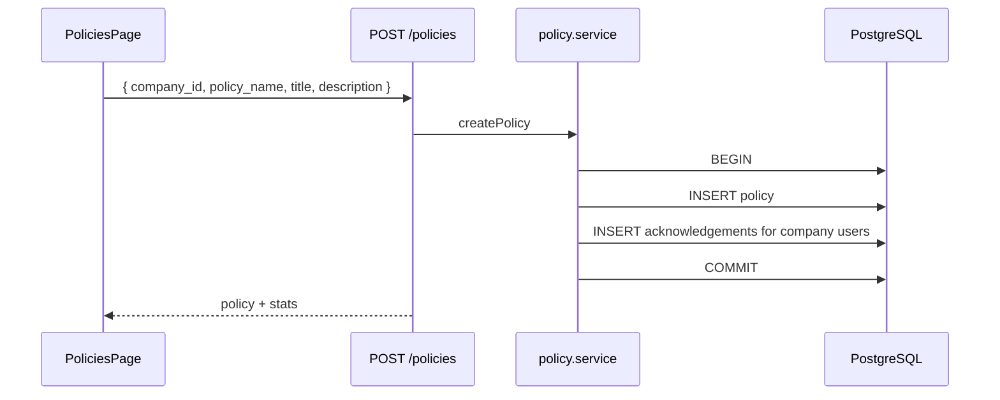

# 7. Policy module (in-depth)

Route: **`/dashboard/policies`** · API: **`/api/policies`**

---

## 7.1 Purpose

- Define **company-scoped** support policies
- Auto-assign new policies to all active users on that company
- Track **acknowledgements** per user
- Admin actions: assign, reset, restrict individual users

---

## 7.2 Data model

**`policies`**

| Column | Notes |
|--------|--------|
| `id` | UUID |
| `company_id` | FK → companies |
| `policy_name` | Internal slug (migration 005) |
| `title` | Display title |
| `description` | Full policy text |
| `is_active`, `is_deleted` | |

**`policy_acknowledgements`**

| Column | Notes |
|--------|--------|
| `policy_id`, `user_id` | UNIQUE together |
| `company_id` | Denormalized |
| `is_acknowledged` | boolean |
| `acknowledged_at` | timestamptz when true |

---

## 7.3 API reference

| Method | Path | Description |
|--------|------|-------------|
| GET | `/api/policies` | Paginated list |
| POST | `/api/policies` | Create + auto-assign users |
| GET | `/api/policies/:id` | Detail + stats + users |
| PUT | `/api/policies/:id` | Update |
| DELETE | `/api/policies/:id` | Soft delete |
| GET | `/api/policies/:id/status` | Ack breakdown |
| POST | `/api/policies/:id/assign-user` | `{ user_id }` |
| POST | `/api/policies/:id/reset-user` | Clear acknowledgement |
| POST | `/api/policies/:id/restrict-user` | Remove user row |

**List query:** `search`, `company_id`, `status` (`all`|`pending`|`complete`|`unassigned`), `page`, `limit`

**Create body:**

```json
{
  "company_id": "company-uuid",
  "policy_name": "order-return-policy",
  "title": "Order Return Policy",
  "description": "Full policy text here..."
}
```

---

## 7.4 Backend: routes

`backend/src/routes/policy.routes.js`:

```javascript
router.use(authenticate, requireAdmin);

router.get("/", validate(listPoliciesQuerySchema, "query"), policyController.list);
router.post("/", validate(createPolicySchema), policyController.create);
router.get("/:id/status", policyController.getStatus);
router.get("/:id", policyController.getOne);
router.put("/:id", validate(updatePolicySchema), policyController.update);
router.delete("/:id", policyController.remove);
router.post("/:id/assign-user", validate(userIdBodySchema), policyController.assignUser);
router.post("/:id/reset-user", validate(userIdBodySchema), policyController.resetUser);
router.post("/:id/restrict-user", validate(userIdBodySchema), policyController.restrictUser);
```

---

## 7.5 Create policy (transaction)

`backend/src/services/policy.service.js` + `policy.model.js`:

1. Verify `company_id` exists
2. `INSERT INTO policies (...)`
3. Select all **active users** linked to company via `user_companies`
4. `INSERT INTO policy_acknowledgements` for each user (`is_acknowledged = false`)

All in one DB transaction — rollback if any step fails.

---

## 7.6 Per-user actions

| Endpoint | Effect |
|----------|--------|
| `assign-user` | Upsert acknowledgement row (pending) |
| `reset-user` | `is_acknowledged = false`, `acknowledged_at = null` |
| `restrict-user` | Delete acknowledgement row |

Body for all three:

```json
{ "user_id": 12 }
```

---

## 7.7 Validation

`backend/src/validators/policy.validator.js`:

```javascript
const createPolicySchema = Joi.object({
  company_id: uuid.required(),
  policy_name: Joi.string().trim().min(2).max(200).required(),
  title: Joi.string().trim().min(2).max(200).required(),
  description: Joi.string().trim().min(1).max(10000).required(),
});
```

---

## 7.8 Frontend

**Page:** `frontend/src/app/dashboard/policies/page.tsx`

- Stats cards: total, acknowledged (page), pending (page)
- Filters: search, company, status
- Table with view/edit/delete
- Create/edit via `PolicyForm`
- Deep link: `?view=<policyId>` opens `PolicyAckDrawer`

**Policy name helper** — `frontend/src/lib/slug.ts`:

```typescript
export function titleToPolicyName(title: string): string {
  return title
    .toLowerCase()
    .trim()
    .replace(/[^a-z0-9]+/g, "-")
    .replace(/^-|-$/g, "");
}
```

**API client** — `frontend/src/lib/policies.ts` wraps all endpoints.

**Drawers/modals:**

- `PolicyAckDrawer.tsx` — policy body + user list + admin actions
- `PolicyStatusModal.tsx` — acknowledgement breakdown
- `PolicyViewDrawer.tsx` — read-only detail

**Redirect route** — `policies/[id]/page.tsx`:

```typescript
router.replace(`/dashboard/policies?view=${id}`);
```

---

## 7.9 End-to-end flow (create)



---

## 7.10 Dependencies

| Module | Why |
|--------|-----|
| Company | `company_id` on every policy |
| User | Users mapped to company receive acknowledgements |

---

## 7.11 curl examples

See full list in [policy-api.md](../policy-api.md).

```bash
TOKEN="..."
curl -H "Authorization: Bearer $TOKEN" \
  "http://localhost:5000/api/policies?page=1&limit=10"

curl -X POST -H "Authorization: Bearer $TOKEN" \
  -H "Content-Type: application/json" \
  -d '{"company_id":"...","policy_name":"test","title":"Test","description":"Body"}' \
  http://localhost:5000/api/policies
```

---

## 7.12 Files checklist

| Layer | Files |
|-------|--------|
| Routes | `routes/policy.routes.js` |
| Service | `services/policy.service.js` |
| Model | `models/policy.model.js` |
| Validator | `validators/policy.validator.js` |
| Frontend | `policies/page.tsx`, `PolicyForm.tsx`, `PolicyAckDrawer.tsx`, `lib/policies.ts` |

---

## 7.13 Documentation index

← Back to [guides README](./README.md)
